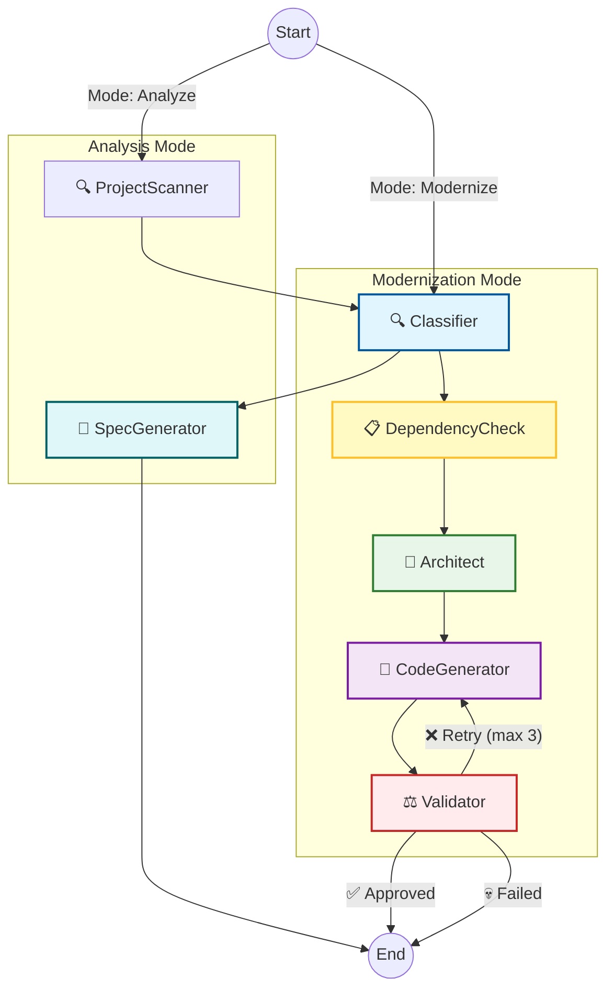

# Assembly Line Modernizer - Architecture & Agent Flow

## 🏗️ System Architecture

The system implements a **multi-agent sequential workflow** using LangGraph. It mimics a factory assembly line where each agent specializes in a specific stage of the modernization process.

It now supports two distinct modes:
1.  **Analysis Mode**: Generates detailed specifications for legacy code.
2.  **Modernization Mode**: Performs the actual code migration.

---

## 🔄 End-to-End Agent Flow

### 0. 🔍 ProjectScanner (New)
**Input:** Project Directory or ZIP
**Role:** Scans the entire codebase *before* individual file processing to build context.
- **Logic:**
  - Identifies tech stack (Java, JSF, React, etc.).
  - Maps Java package structure.
  - Parses build files (pom.xml, package.json) for global dependencies.
- **Output:** `project_context` dictionary passed to all agents.
- **Modes:** Runs in both **Analysis** and **Modernization** modes.

### 1. 🔍 Classifier
**Input:** Raw Legacy File (e.g., `UserController.java`, `users.xhtml`)
**Role:** Identifies what the file is and what it contains.
- **Logic:**
  - Checks file extensions (`.java`, `.xhtml`, `.xml`).
  - Scans content for specific patterns (e.g., `<p:dataTable>` for PrimeFaces).
  - **AI Fallback:** If the rule-based check fails, it asks Gemini to classify the file.
- **Output to State:**
  - `file_type`: e.g., `"backend"`, `"jsf_view"`, `"build_ant"`
  - `target_extension`: e.g., `".java"`, `".tsx"`, `".gradle"`
  - `detected_components`: List of UI components (e.g., `['p:dataTable', 'p:dialog']`)

### 2. 📄 SpecGenerator (New)
**Input:** Legacy Content + File Type
**Role:** Generates a detailed technical specification for the file.
- **Logic:**
  - Uses a specialized prompt to extract Requirements, Technical Details, and Overview.
  - Saves output to `workspace/output_specs/[filename].spec.md`.
- **Output to State:**
  - `specification`: The generated markdown text.

### 3. 📋 DependencyCheck
**Input:** Classification Data
**Role:** Ensures the file is ready to be processed.
- **Logic:**
  - Checks if dependencies are met (currently a placeholder for complex dependency graphs).
  - Can block processing if prerequisites aren't found.
- **Output to State:**
  - `is_ready_to_process`: `True` or `False`

### 4. 📝 Architect
**Input:** Legacy Content + File Type
**Role:** Creates a detailed, step-by-step modernization roadmap.
- **Logic:**
  - Selects a specialized prompt based on `file_type`.
  - Generates a markdown checklist of changes required (e.g., "Replace @ManagedBean with @RestController", "Convert <p:dataTable> to PrimeReact DataTable").
- **Output to State:**
  - `modernization_plan`: A text-based plan guiding the CodeGenerator.

### 5. 🔨 CodeGenerator
**Input:** Legacy Content + Modernization Plan + Specialized Prompt
**Role:** Performs the actual code transformation.
- **Logic:**
  - Loads the specific prompt for the layer (e.g., `backend_java21_spring.txt` or `frontend_jsf_to_react.txt`).
  - Injects the `modernization_plan` and `detected_components` into the context.
  - Generates the modern code using Gemini 2.5 Flash.
- **Output to State:**
  - `modern_code`: The transformed code (e.g., Spring Boot Controller or React Component).

### 6. ⚖️ Validator
**Input:** Generated Modern Code
**Role:** Validates the output against strict quality rules.
- **Logic:**
  - Checks for forbidden patterns (e.g., `javax.faces` imports in backend, JSF tags in frontend).
  - Verifies required patterns (e.g., `@RestController` exists, React imports exist).
- **Decision:**
  - **✅ Approved:** Workflow ends.
  - **❌ Retry:** Sends feedback back to **CodeGenerator** to fix specific errors (loops up to 3 times).
  - **💀 Failed:** Marks as failed if retries are exhausted.

---

## 📂 Data Flow (The Assembly Line)

The `AgentState` object is passed along the conveyor belt, accumulating data at each step:

| Step | Data Added to State |
|------|---------------------|
| **Start** | `legacy_filepath`, `legacy_content` |
| **Classifier** | `file_type`, `target_extension`, `detected_components` |
| **SpecGenerator** | `specification` (Analysis Mode only) |
| **DependencyCheck** | `status="in_progress"` |
| **Architect** | `modernization_plan` |
| **CodeGenerator** | `modern_code`, `iteration_count` |
| **Validator** | `compilation_errors`, `status="complete"|"retry"` |

## 📊 Final Output

1. **Modernized File:** The transformed code saved with the correct extension (e.g., `users.tsx`).
2. **JSON Report:** A comprehensive `.report.json` file containing the classification, plan, execution stats, and status (saved to `reports_dir`).
3. **Specifications:** Detailed `.spec.md` files in `workspace/output_specs` (when running in Analysis Mode).
4. **Project Summary:** A consolidated `project_summary.md` report (Analysis Mode).
5. **ZIP Archive:** `modernized_app.zip` (if input was a ZIP file).
